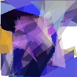

# The project
The code contained in the `challenge/` folder is a small CLI program written in rust that finds an approximation of an image for a given number of random triangles (50).
Here is what the program does:

1. It draws 50 random triangles in a blank image
2. In the loop of the main function, it selects a random triangle and changes (mutates) either the coordinate of a vertice (point) or the color of the triangle (RGBA)
3. For each iteration, the program calculates the distance (or difference) between the current image and the target image via the `fitness` function.
4. If the distance between the current image and the target image is better than the previous iteration, then the mutation is accepted, otherwise the mutation is discarded.
5. After X iterations, the program renders the image, saves it to disk and exits.

Here is an example of the target and the output images after 1_000_000 iterations, with 50 triangles and a fitness score of 14.24: 

 
 


## Challenge:
* Find 3 (or more) possible optimizations for this program to run faster. (Hint: think about the number of operations happening for each iteration, number of cores on your machine or concurrency)
* You don't need to implement the optimizations.

## Install & run

If you want to run the program you'll need to install the rust compiler and the toolchain on your machine.
For Unix-Like system:
```bash
▶ curl --proto '=https' --tlsv1.2 -sSf https://sh.rustup.rs | sh
```

Or you can visit the official rust website: https://www.rust-lang.org/tools/install

Clone the repo:
```bash
▶ git clone https://github.com/Sinacosa/labs-code-challenge.git
```

To run the program, just run the following command in the `challenge/` folder:
```bash
▶ cd labs-code-challenge/challenge
▶ cargo run
```
