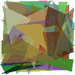
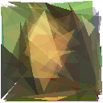
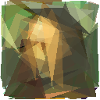
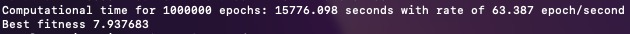

To complete the challenge, I suggest 8 (4 major and 3 minor) optimizations on the baseline code, which I implemented, and 1 which I did not.
To evaluate the performance of the program, it is elapsed all epoch times. An epoch consists of the following step: mutation, draw, evaluation, and update.

## Program Description:
The goal of this program is to replicate a target image with a set of N overlapped polygons with V vertices. In each epoch, it is randomly selected a random polygon and one of its vertices (x,y) or an RGBA parameter is randomly modified. At the end of each epoch, if the modification closes the gap between the generation and the target image, the modification is kept. In this specific version, it used triangles and the stacking order is fixed. In the end, the program generates an image with the same dimensions as the target image: L(ength)=W(idth)\*H(eight).

To run the model do:

  <code> cargo run <number of epochs> </code>
  <button>Copy</button>

---
## Implementations

1. [Deeper Immutable Layers](#deeper-immutable-layers))
* Saving the pixels of each triangle

    2. [Outer Immutable Layers](#outer-immutable-layers)
    3. [Fitness Function](#fitness-function)
4. [Specific struct for the new shape in the test](#struct-for-the-new-shape-in-the-test)
5. [Changing a value on the on-test shape](#changing-a-value-on-the-on-test-shape)
6. [Constant operation terms in drawing a triangle](#constant-operation-terms-in-drawing-a-triangle)
7. [Passing by reference instead of by value](#passing-by-reference-instead-of-by-value)

### Terminology 

**A** is the complexity required to [get the smallest rectangle around each triangle, compute whether a specific pixel is inside the triangle, and put it on the image](https://github.com/Sinacosa/labs-code-challenge/blob/4bbb23e053ddeda40ecb5adf04ab6b826eef72f5/challenge/src/main.rs#L200).

**L** is the total length of the image (i.e. width \* height).

**N** is the number of triangles.

**E** is the number of epochs.

The complexity to iterate over all pixels of a Triangle varies on the occupied area of the triangle from [1, L/2]. Let's use **T** as the average complexity to iterate over a triangle shape.

---
Major Optimizations
---

### Deeper Immutable Layers
`Baseline` For each epoch the program is [resetting every pixel of the image](https://github.com/Sinacosa/labs-code-challenge/blob/4bbb23e053ddeda40ecb5adf04ab6b826eef72f5/challenge/src/main.rs#L73). Therefore the complexity is O(N*L). Additionally, [it is drawn every triangle each epoch](https://github.com/Sinacosa/labs-code-challenge/blob/4bbb23e053ddeda40ecb5adf04ab6b826eef72f5/challenge/src/main.rs#L108) with complexity O(N*A).

`Optimized` [It saves the composition of the image before stacking each layer](https://github.com/Joao-Tiago-Almeida/labs-code-challenge/blob/a2b04ebe5c9211dc67e0578106a0c9e30e578dc8/challenge/upgrade/src/main.rs#L168). Therefore, [when a new shape is tested, it is drawn on top of how the image with the lowest distance so far only with the deeper layers stacked](https://github.com/Joao-Tiago-Almeida/labs-code-challenge/blob/a2b04ebe5c9211dc67e0578106a0c9e30e578dc8/challenge/upgrade/src/main.rs#L165). This saves a complexity of O(index\*A) and does not require reseating the image every epoch.

### Outer Immutable Layers
`Baseline` Similar to the above reasoning, the program is used to draw every immutable triangle.

`Optimized` The program saved the coordinates of the pixels corresponding to the drawing triangles. Therefore, [for each layer on top of the current, it is only needed to look at the affected pixels](https://github.com/Joao-Tiago-Almeida/labs-code-challenge/blob/a2b04ebe5c9211dc67e0578106a0c9e30e578dc8/challenge/upgrade/src/main.rs#L166). Altogether with the previous update, the complexity for the "drawing" step is O(1+A+T\*(N-index)), getting the deeper layers information + testing the newest shape + drawing the outer layers on top, respectively.

### Fitness Function
`Baseline` For each epoch, it is [looped through all pixels to compute the distance between generated and target image](https://github.com/Sinacosa/labs-code-challenge/blob/4bbb23e053ddeda40ecb5adf04ab6b826eef72f5/challenge/src/main.rs#L116) this has a complexity of O(L).

`Optimized` The program saved the coordinates of the pixels corresponding to the drawing triangles. Alongside saving the distance between images for each pixel, the fitness function only computes the difference in the pixels where there was a change: pixels of [the current best](https://github.com/Joao-Tiago-Almeida/labs-code-challenge/blob/a2b04ebe5c9211dc67e0578106a0c9e30e578dc8/challenge/upgrade/src/main.rs#L186) and [the newest](https://github.com/Joao-Tiago-Almeida/labs-code-challenge/blob/a2b04ebe5c9211dc67e0578106a0c9e30e578dc8/challenge/upgrade/src/main.rs#L193) triangle, with a complexity of O(2T)≈O(T).

**Update:** This step could be even more optimized if it is saved the difference already without the current best.

### Struct for the new shape in the test
`Baseline` In each iteration it was copied [the struct with all the shapes to a new struct](https://github.com/Sinacosa/labs-code-challenge/blob/4bbb23e053ddeda40ecb5adf04ab6b826eef72f5/challenge/src/main.rs#L159) where only one triangle is modified. The complexity of this is O(N) in each epoch.

`Optimized` It is designated a [struct for the on-test shape](https://github.com/Joao-Tiago-Almeida/labs-code-challenge/blob/a2b04ebe5c9211dc67e0578106a0c9e30e578dc8/challenge/src/main.rs#L170), and all modifications are saved there. The only complexity is the one-time creation of the struct. 

---
Minor Optimizations
---

### Changing a value on the on-test shape
 `Baseline` The program was fetching either a new [colour](https://github.com/Sinacosa/labs-code-challenge/blob/4bbb23e053ddeda40ecb5adf04ab6b826eef72f5/challenge/src/main.rs#L169) or [Point struct](https://github.com/Sinacosa/labs-code-challenge/blob/4bbb23e053ddeda40ecb5adf04ab6b826eef72f5/challenge/src/main.rs#L165). This implicates overwritten all 10 values (6 coordinates and 4 RGBA colour properties). 

`Optimized` It is only changed the specific value(s) either a [colour](https://github.com/Joao-Tiago-Almeida/labs-code-challenge/blob/a2b04ebe5c9211dc67e0578106a0c9e30e578dc8/challenge/upgrade/src/main.rs#L249) property or a set of [2D coordinates](https://github.com/Joao-Tiago-Almeida/labs-code-challenge/blob/a2b04ebe5c9211dc67e0578106a0c9e30e578dc8/challenge/upgrade/src/main.rs#L244).

### Constant operation terms in drawing a triangle
 `Baseline` In the computations of the boundaries of each triangle, [some constant operations were happening every iteration ](https://github.com/Sinacosa/labs-code-challenge/blob/4bbb23e053ddeda40ecb5adf04ab6b826eef72f5/challenge/src/main.rs#L220) every iteration.

`Optimized` [The constant terms are computed outside the loop iteration.](https://github.com/Joao-Tiago-Almeida/labs-code-challenge/blob/a2b04ebe5c9211dc67e0578106a0c9e30e578dc8/challenge/upgrade/src/main.rs#L292) It saves register operations such as (4 moves, 1 complement and 1 add operation) for each pixel of the smallest rectangle.

### Passing by reference instead of by value
`Baseline` The program was [returning some values by value](https://github.com/Sinacosa/labs-code-challenge/blob/4bbb23e053ddeda40ecb5adf04ab6b826eef72f5/challenge/src/main.rs#L50). Which overwrites the values of a complete struct.

`Optimized` It [allocates and initialized all the structs](https://github.com/Joao-Tiago-Almeida/labs-code-challenge/blob/a2b04ebe5c9211dc67e0578106a0c9e30e578dc8/challenge/upgrade/src/main.rs#L72) before the main loop starts and it is passed the pointers to all structs according to the requirements of each function and each mutable value is changed in the specific struct.

---

Finally, in each epoch, four processes are forming a pipeline. However not all the processes are dependent on the others to actuate in future iterations. For example, the mutation process is independent of the remaining therefore it could be done parallelly. All the remaining processes are dependent on the best values encountered so far. Therefore, one possible improvement would be having two threads runnning parallelly, and since the mutation process should be faster than others it does not count for the final complexity.

---

### Complexity

Epoch | `Baseline` | `Optimized`
:---: | :---: | :---:
Mutation | O(N) | O(1)
Draw | O(N*A) | O(1+A+T\*(N-index))
Evaluation | OT(L) | O(T)
Update | O(1) | O(1)
**Total** | O(N*A+L) | O(A+T\*(N-index))

In the end, all complexities are multiplied by O(E) to account for the general complexity of the program.

---

## Final Result
The results below were run consecutively on the same machine under the same conditions.

Program | Epochs | Fitness | Epochs/second | Computational Time (HH:MM:SS:MS) | Output
:---: | :---: | :---: | :---: | :---: | :---:
`Baseline` | 100 | 57.98 | 35.600 | 00:00:02:81 |
`Optimized` | 100 | 55.57 | 57.274 | 00:00:01:74 | 
`Baseline` | 1k | 30.96 | 34.249 | 00:00:29:20 |
`Optimized` | 1k | 32.86 | 52.801 | 00:00:19:61 | 
`Baseline` | 5k | 20.08 | 34.779 | 00:02:23:765 |
`Optimized` | 5k | 19.36 | 53.014 | 00:01:34:32 | 
`Baseline` | 10k | 18.54 | 29.467 | 00:05:39:363 |
`Optimized` | 10k | 17.63 | 54.999 | 00:03:01:822 | 
`Optimized` | 1M | 7.94 | 63.387 | 4:22:56:098 | _see below_

For 1M epochs, the program took 4 hours and 23 minutes, with an average of 63.387 epochs/second. The output image has a fitness rate of 7.94 compared to the target image.

Terminal Output | Generated Image | Target Image
:---: | :---: | :---: 
 |  | 

`Note` The rate of epochs/second is more constant in the baseline version compared to the optimized version. As explained below this fluctuation is explained by the dependency on the area of the triangles. On the opposite, in the baseline solution, the program computes every pixel of the image or a rectangle containing the triangle, which has fewer variations.

`Improvement`The output results show improvements with the optimized version with an average of 168%, in a range between [146, 215]%. Furthermore, the higher the number of epochs is, the bigger the improvement becomes.